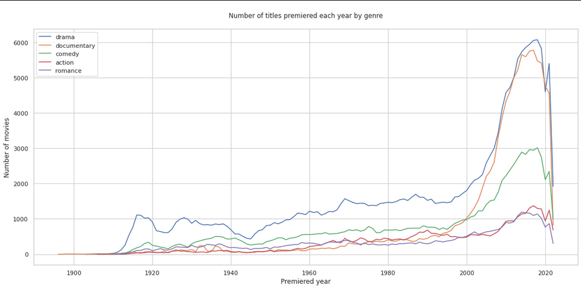
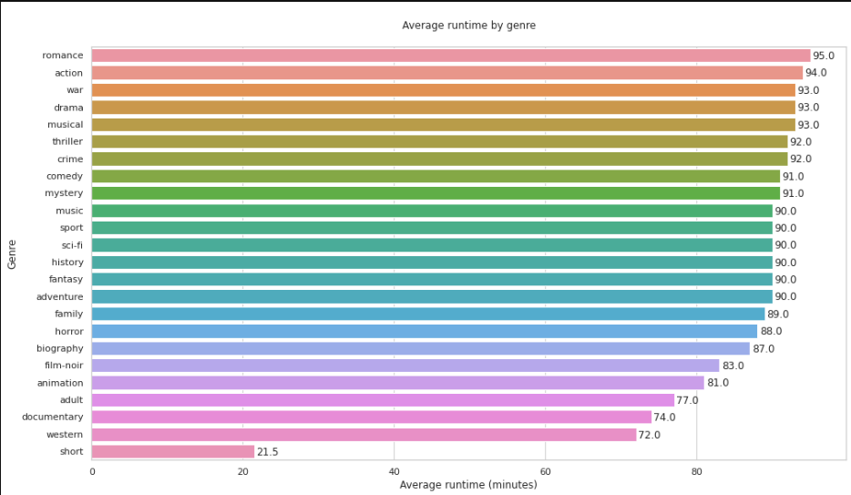
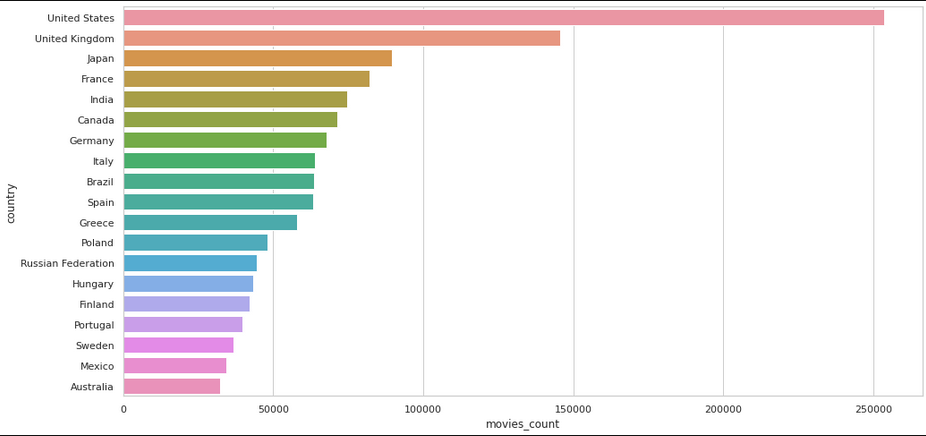

<h1 align="center">IMDB Data Analysis</h1>

Basic analysis regarding the available IMDB data

 

<h2 align="center">Analysis made</h2>

### 1. The most common content categories in IMDB

### 2. Percentage of movies by genre

### 3. Median of movie ratings by genre

### 4. Median of movie ratings by release year

### 5. Number of titles premiered each year by genre

### 6. Average runtime by genre

### 7. Number of movies by country

<h2>License</h2>
This repository lies under the MIT License. See <a href="https://github.com/Mr0l3/imdb-data-analysis/blob/main/LICENSE">LICENSE</a> for more information.
