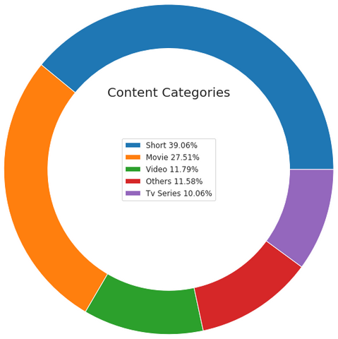
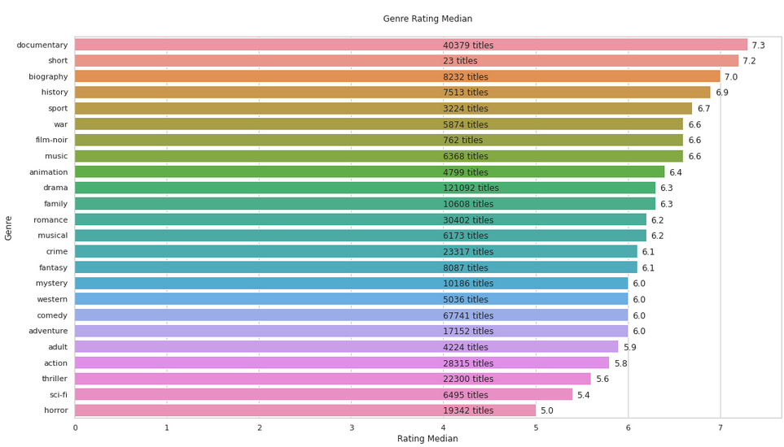
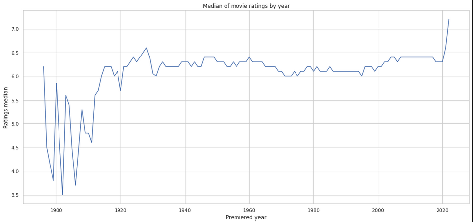

# IMDB Data Analysis
Basic analysis regarding the available IMDB data

___

## Analysis made

### 1. The most common content categories in IMDB

### 2. Percentage of movies by genre

### 3. Median of movie ratings by genre

### 4. Median of movie ratings by release year
